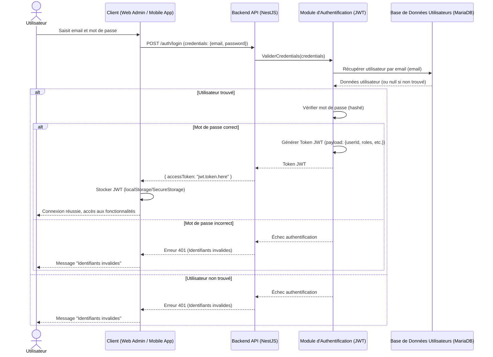

# Analyse de l'Architecture Technique du Projet Famillink

## 1. Introduction

Ce document présente une analyse détaillée de l'architecture technique retenue pour le projet Famillink. L'objectif de Famillink est de fournir un système de gestion pour une association familiale, comprenant un backend, une application web d'administration et une application mobile de consultation. Les fonctionnalités clés incluent la gestion des membres, de l'arbre généalogique, des actualités et des anniversaires. Une distinction importante est faite entre les membres de l'association et les utilisateurs du système.

L'architecture s'appuie sur un ensemble de technologies modernes et éprouvées : MariaDB, Brevo pour les emails, authentification par token JWT, backend en NestJS avec TypeORM, application web d'administration en Angular, et application mobile avec Capacitor. Le déploiement est prévu sur un VPS avec Docker, Docker Swarm, Traefik et Grafana.

## 2. Contraintes Induites par les Choix Technologiques

L'adoption de cette stack technologique, bien que performante, introduit certaines contraintes à considérer :

*   **Courbe d'apprentissage et Expertise Requise :**
    *   **NestJS & Angular :** Ces frameworks, bien que puissants, ont une courbe d'apprentissage. L'équipe devra posséder ou acquérir une expertise solide en TypeScript, RxJS (pour Angular), et les concepts spécifiques à NestJS (modules, décorateurs, pipes, guards, etc.).
    *   **TypeORM :** Bien qu'il simplifie les interactions avec la base de données, une bonne compréhension des ORM, des migrations de schéma et des optimisations de requêtes est nécessaire pour éviter les problèmes de performance.
    *   **Capacitor :** Permet de construire des applications mobiles à partir de technologies web, mais la gestion des plugins natifs, les spécificités de chaque plateforme (iOS/Android) et les performances peuvent représenter des défis. Le choix du framework web sous-jacent (Angular, React, Vue) pour l'UI de l'application mobile aura aussi ses propres contraintes.
    *   **Docker & Docker Swarm :** La conteneurisation simplifie le déploiement, mais nécessite une compréhension de la gestion des conteneurs, des réseaux Docker, des volumes, et de l'orchestration avec Swarm.
    *   **Traefik & Grafana :** La configuration et la maintenance de Traefik (reverse proxy) et Grafana (monitoring) demandent des compétences spécifiques en administration système et en configuration de ces outils.

*   **Complexité de l'Écosystème :**
    *   La multiplication des technologies (backend, frontend web, frontend mobile, base de données, services externes, outils de déploiement) augmente la complexité globale du système à développer, maintenir et déboguer.
    *   La gestion des dépendances avec PNPM, bien qu'efficace, doit être maîtrisée par toute l'équipe.

*   **Dépendances Externes :**
    *   **Brevo :** Le projet dépend de Brevo pour l'envoi des emails. Toute indisponibilité, changement de politique tarifaire ou modification d'API de Brevo pourrait impacter le système. Une stratégie de mitigation (ex: interface abstraite pour le service d'email) pourrait être envisagée.

*   **Gestion des JWT :**
    *   Bien que standard, la gestion des tokens JWT (stockage sécurisé côté client, gestion de l'expiration, révocation, rafraîchissement) doit être implémentée avec soin pour éviter les failles de sécurité.

*   **Hébergement VPS :**
    *   Un VPS offre de la flexibilité mais implique une responsabilité totale en matière de gestion du serveur (sécurité, mises à jour, sauvegardes, monitoring). Docker Swarm simplifie l'orchestration mais ne dispense pas de cette gestion.

*   **Distinction Membre/Utilisateur :**
    *   Cette distinction, bien que fonctionnellement nécessaire, complexifie le modèle de données et la logique métier. La gestion des droits et des accès devra être particulièrement rigoureuse pour s'assurer que les utilisateurs accèdent uniquement aux données pertinentes.

*   **Maintenance et Évolutivité :**
    *   Maintenir à jour toutes les dépendances (NPM, frameworks, Docker images) sur l'ensemble de la stack demandera un effort continu.
    *   L'évolutivité horizontale avec Docker Swarm est un atout, mais la base de données MariaDB pourrait devenir un goulot d'étranglement si elle n'est pas correctement optimisée et, potentiellement, répliquée.

## 3. Forces de l'Architecture Proposée

L'architecture choisie présente de nombreux avantages pour le projet Famillink :

*   **Productivité et Cohérence avec TypeScript :**
    *   L'utilisation de TypeScript pour le backend (NestJS) et potentiellement pour les frontends (Angular, et si Angular/React/Vue est choisi pour Capacitor) permet une meilleure cohérence du code, un typage fort réduisant les erreurs, et une meilleure maintenabilité.

*   **Frameworks Modernes et Structurants :**
    *   **NestJS :** Offre une architecture modulaire, inspirée d'Angular, qui favorise une organisation claire du code backend. Son écosystème riche (intégration TypeORM, Swagger pour la documentation API, etc.) accélère le développement.
    *   **Angular :** Framework frontend complet et opinioné, idéal pour des applications d'administration complexes. Il fournit des outils robustes pour la gestion des états, le routing, et les formulaires.
    *   **TypeORM :** Un ORM mature pour TypeScript, facilitant les interactions avec MariaDB et permettant de définir clairement les entités et leurs relations.

*   **Flexibilité pour l'Application Mobile :**
    *   **Capacitor :** Permet de réutiliser les compétences web pour le développement mobile, réduisant potentiellement les coûts et les délais. Il offre un bon accès aux fonctionnalités natives si nécessaire.

*   **Scalabilité et Résilience du Déploiement :**
    *   **Docker & Docker Swarm :** La conteneurisation assure la portabilité et la reproductibilité des environnements. Docker Swarm permet une orchestration simple pour la scalabilité horizontale et la haute disponibilité des services.
    *   **Traefik :** Simplifie la gestion du reverse proxying, du load balancing et des certificats SSL (via Let's Encrypt), s'intégrant bien avec Docker.

*   **Sécurité :**
    *   **JWT :** Standard éprouvé pour l'authentification stateless, bien adapté aux architectures microservices ou API-centric.
    *   L'utilisation de frameworks maintenus et d'outils comme Traefik contribue à une meilleure posture de sécurité de base.

*   **Observabilité :**
    *   **Grafana :** Permet de mettre en place un monitoring efficace des différents composants de l'infrastructure et des applications, essentiel pour la détection proactive des problèmes.

*   **Gestion des Données Robuste :**
    *   **MariaDB :** Base de données relationnelle open-source, fiable, performante et largement supportée, adaptée pour stocker les données structurées de l'association.

*   **Écosystème de Développement :**
    *   **PNPM :** Gestionnaire de paquets efficace, économisant de l'espace disque et améliorant la vitesse d'installation des dépendances.
    *   **VS Code & GitHub :** Outils standards et performants pour le développement, la gestion des sources et la collaboration.

*   **Séparation Claire des Préoccupations :**
    *   L'architecture distingue clairement le backend (logique métier, API), l'application d'administration (interface web) et l'application de consultation (interface mobile), ce qui favorise la modularité et la maintenabilité.

## 4. Diagramme des Composants

```mermaid
graph TD
    UtilisateurWebAdmin[Utilisateur Admin] --> WebAppAdmin[Application Web Admin (Angular)]
    UtilisateurMobile[Membre/Utilisateur Mobile] --> MobileApp[Application Mobile (Capacitor + Web Framework)]

    WebAppAdmin -->|Requêtes API REST/GraphQL sécurisées (JWT)| BackendAPI[Backend API (NestJS)]
    MobileApp -->|Requêtes API REST/GraphQL sécurisées (JWT)| BackendAPI

    BackendAPI -->|Logique métier & ORM| TypeORM[TypeORM Module]
    TypeORM --> MariaDB[(MariaDB Database)]
    BackendAPI -->|Envoi d'emails (ex: notifications)| Brevo[Service d'Email Externe (Brevo)]
    BackendAPI -->|Génération/Validation de Tokens| JWTAuth[Module d'Authentification JWT]

    subgraph "Interface Utilisateur"
        direction LR
        WebAppAdmin
        MobileApp
    end

    subgraph "Serveur Applicatif & Logique Métier"
        direction TB
        BackendAPI
        subgraph "Persistance & Services Internes"
            direction LR
            JWTAuth
            TypeORM
        end
    end

    subgraph "Base de Données"
        MariaDB
    end

    subgraph "Services Externes Tiers"
        Brevo
    end
```

## 5. Diagramme de Déploiement

```mermaid
graph TD
    UtilisateursFinaux[Utilisateurs (Web Admin / Mobile)] -->|HTTPS via Internet| LoadBalancerTraefik[Traefik Reverse Proxy & Load Balancer]

    subgraph VPS [Serveur(s) VPS]
        direction LR
        subgraph DockerSwarmCluster[Docker Swarm Cluster]
            direction TB
            LoadBalancerTraefik --> ServiceWebAppContainer[Service Web App Admin (Conteneur Angular)]
            LoadBalancerTraefik --> ServiceBackendAPIContainers[Service Backend API (Conteneurs NestJS)]
            
            ServiceBackendAPIContainers --> ServiceMariaDBContainer[Service MariaDB (Conteneur)]
            ServiceBackendAPIContainers -->|Appel API| BrevoAPIServer[(Brevo API - Externe)]
            
            ServiceMonitoringGrafana[Service Grafana (Conteneur)] -->|Collecte de métriques| ServiceBackendAPIContainers
            ServiceMonitoringGrafana -->|Collecte de métriques| ServiceMariaDBContainer
            ServiceMonitoringGrafana -->|Collecte de métriques| LoadBalancerTraefik
            LoadBalancerTraefik -->|Accès Dashboard (sécurisé)| ServiceMonitoringGrafana
        end
    end
    style VPS fill:#f9f,stroke:#333,stroke-width:2px
    style DockerSwarmCluster fill:#ccf,stroke:#333,stroke-width:2px
```

## 6. Diagrammes de Flux Principaux

### 6.1. Flux d'Authentification d'un Utilisateur (avec JWT)



### 6.2. Flux de Création d'une Actualité (par un Administrateur)

```mermaid
sequenceDiagram
    actor Admin
    participant WebAdminApp as Application Web Admin (Angular)
    participant BackendAPI as Backend API (NestJS)
    participant NewsModule as Module Actualités (Backend)
    participant AuthGuard as Guard d'Authentification/Autorisation (Backend)
    participant NewsDB as Base de Données Actualités (MariaDB)
    participant NotificationService as Service de Notification (Backend, utilisant Brevo)

    Admin->>WebAdminApp: Remplit et soumet le formulaire de création d'actualité (titre, contenu, pièces jointes, etc.)
    WebAdminApp->>BackendAPI: POST /actualites (data: {actualiteDetails}, Authorization: Bearer JWT)
    BackendAPI->>AuthGuard: Vérifier Token JWT et Rôle Admin
    alt Token valide et Admin autorisé
        AuthGuard-->>BackendAPI: Autorisation accordée
        BackendAPI->>NewsModule: CreerActualite(actualiteDetails)
        NewsModule->>NewsDB: Insérer nouvelle actualité (actualiteDetails)
        NewsDB-->>NewsModule: Actualité créée (avec ID)
        NewsModule-->>BackendAPI: Succès (actualiteCreee)
        BackendAPI-->>WebAdminApp: HTTP 201 Created (actualiteCreee)
        WebAdminApp-->>Admin: Message "Actualité créée avec succès"
        
        opt Envoyer notifications
            BackendAPI->>NotificationService: NotifierNouvelleActualite(actualiteCreee)
            NotificationService->>UserDB: Récupérer membres à notifier
            UserDB-->>NotificationService: Liste des emails des membres
            loop Pour chaque membre à notifier
                NotificationService->>Brevo: Envoyer email "Nouvelle actualité" (emailMembre, detailsActualite)
            end
            Brevo-->>NotificationService: Statut des envois
            NotificationService-->>BackendAPI: Confirmation (ou rapport d'erreurs)
        end
    else Token invalide ou Admin non autorisé
        AuthGuard-->>BackendAPI: Échec autorisation (ex: 401 Unauthorized ou 403 Forbidden)
        BackendAPI-->>WebAdminApp: Erreur HTTP (401 ou 403)
        WebAdminApp-->>Admin: Message d'erreur approprié
    end